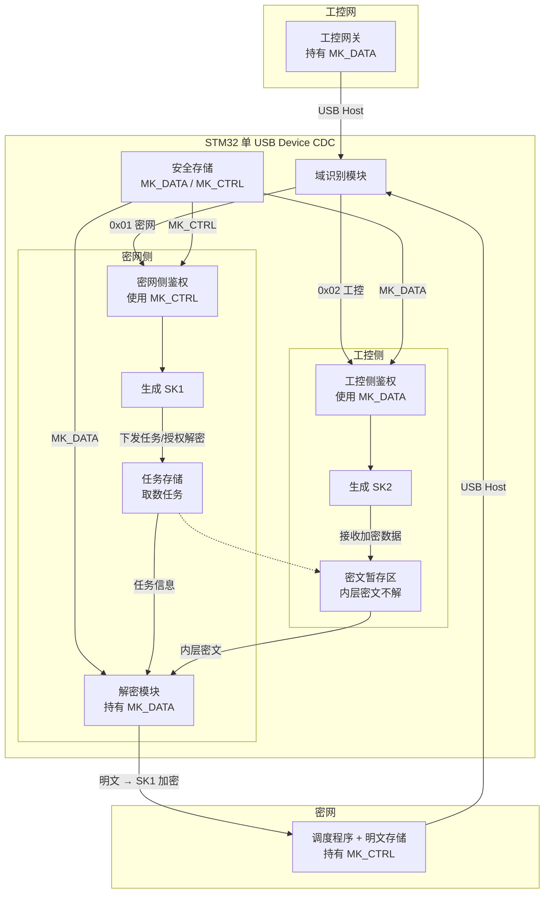
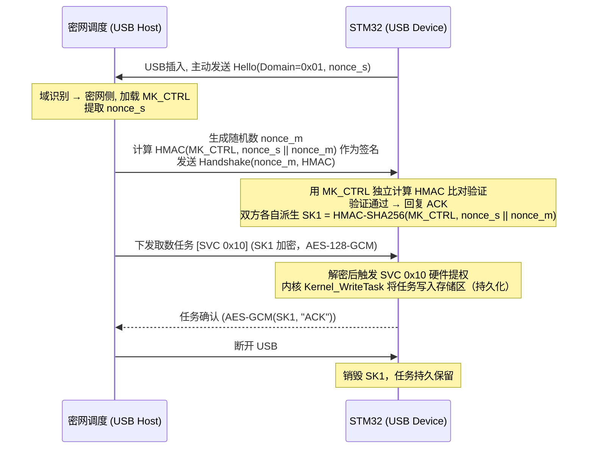
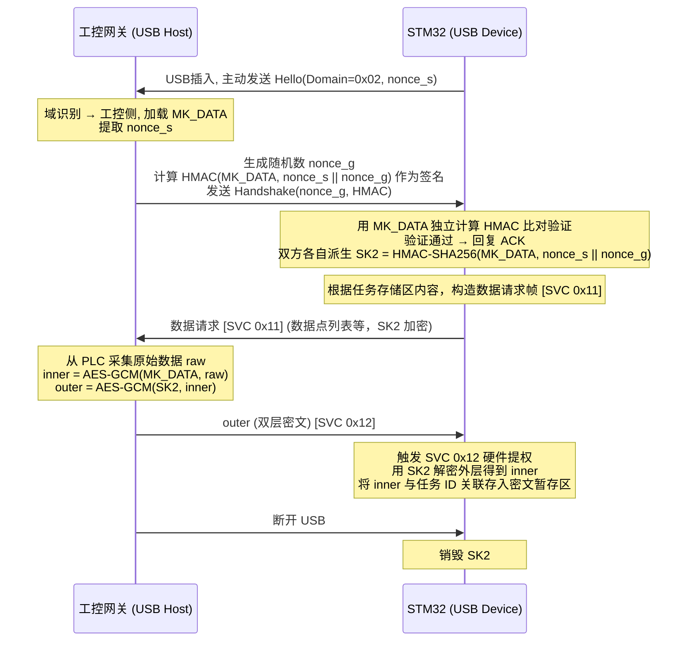
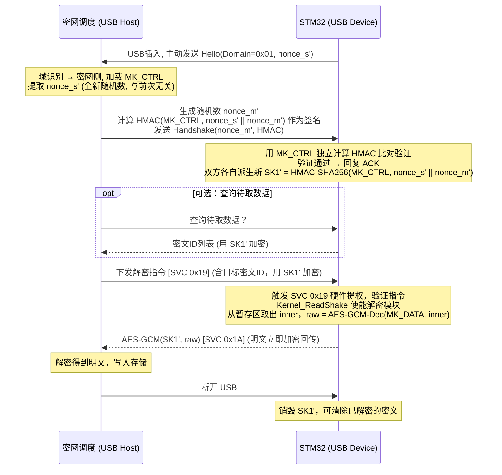

+------------------+          +------------------+
|     工控网        |          |      密网         |
|                  |          |                  |
| PLC <-> 工控网关  |          | 调度程序+明文存储 |
| (持有 MK_DATA)   |          | (持有 MK_CTRL)   |
+--------+---------+          +--------+---------+
         |                             |
         | USB Host                    | USB Host
         |                             |
         +-------+       +-------------+
                 |       |
          (物理开关分时连接)
                 |       |
         +-------+-------+
         |   STM32 单USB  |
         |   Device CDC   |
         +-------+-------+
                 |
    +------------+------------+
    |                         |
+---+---+ 域识别模块  +-----+-----+
| 工控侧 |<--------->| 密网侧     |
| 鉴权   | 选择密钥  | 鉴权       |
| MK_DATA|           | MK_CTRL    |
| 生成SK2|           | 生成SK1    |
+---+---+           +-----+-----+
    |                     |
    | 暂存加密数据         | 接收任务 / 授权解密
    v                     v
+---+------------+  +----+----+------------+
| 密文暂存区     |  | 任务存储 | 解密模块   |
| (内层密文不解) |  | (取数任务) | MK_DATA  |
+----------------+  +---------+------------+
                         |         |
                         +----+----+
                              |
                              v
                    明文 -> SK1加密 -> USB回传

                  
# 安全存储区（位于 STM32 内部，仅各模块可访问）

- **MK_DATA**：工控数据加解密密钥，与工控网关共享。
- **MK_CTRL**：密网控制鉴权密钥，与密网调度程序共享。

---

## 各模块职责与交互

| 模块 | 位置 | 功能 |
|------|------|------|
| 域识别模块 | STM32 USB 驱动层 | 解析握手 Hello 帧首个字节的 Domain 字段（0x01=密网，0x02=工控），据此激活对应侧的鉴权模块，并通知安全存储开放对应密钥访问。 |
| 工控侧鉴权模块 | STM32 内部 | 使用 MK_DATA 与工控网关执行 HMAC 挑战-应答双向认证，并由 HMAC-SHA256(MK_DATA, nonces) 派生会话密钥 SK2。认证通过后，后续的工控数据接收将由该模块解密外层（SK2 层）。 |
| 密网侧鉴权模块 | STM32 内部 | 使用 MK_CTRL 与密网调度程序执行 HMAC 挑战-应答双向认证，并由 HMAC-SHA256(MK_CTRL, nonces) 派生会话密钥 SK1。负责所有密网指令的解密与响应的加密，并控制解密模块的”使能”信号。 |
| 任务存储区 | STM32 非易失性存储 | 保存密网下发的取数任务（例如：目标 PLC 地址、数据点列表、采集周期等），任务可持久化，断电不丢失。任务更新时由密网鉴权模块解密后写入。 |
| 密文暂存区 | STM32 RAM/Flash | 存放从工控网关接收的“内层密文”（由 MK_DATA 加密），并关联任务 ID。该区域数据不解密，仅做临时仓储。 |
| 解密模块 | STM32 内部 | 持有 MK_DATA，但解密动作受密网鉴权模块控制。当且仅当密网通过 SK1 下发合法解密指令，该模块从暂存区取出对应内层密文，用 MK_DATA 解密得到明文，并将明文交给密网鉴权模块加密回传。 |
| 安全存储 | STM32 写保护区域 | 存储 MK_DATA 和 MK_CTRL，只在各自鉴权模块或解密模块内部使用，不可被其他代码读取。 |    

## SVC 立即数映射（与固件 syscall.h 一致）

USB HID 协议命令字节与 ARM SVC 立即数统一编码，`parse_terminal_cmd()` 解析出命令号后直接作为 SVC 立即数触发硬件提权：

| SVC 立即数 | 宏定义 | 方向 | 阶段 | 说明 |
|---|---|---|---|---|
| `0x10` | `SVC_ID_WRITE_TASK` | 密网→STM32 | Phase 0 | 下发任务令牌，`SVC_Router` 分发至 `Kernel_WriteTask`，刻录 Sector 1024 |
| `0x11` | `SVC_ID_READ_TASK` | 工控→STM32 | Phase 1 | 读取任务暗号，`SVC_Router` 分发至 `Kernel_ReadTask`，校验令牌 |
| `0x12` | `SVC_ID_WRITE_DATA` | 工控→STM32 | Phase 1 | 推送明文数据流，`SVC_Router` 分发至 `Kernel_WriteData`，AES 原位加密落盘 |
| `0x19` | `SVC_ID_READ_SHAKE` | 密网→STM32 | Phase 3 | 特权挑战码握手，`SVC_Router` 分发至 `Kernel_ReadShake`，解锁回读状态机 |
| `0x1A` | `SVC_ID_READ_DATA` | 密网→STM32 | Phase 3 | 批量抽取密文流，`SVC_Router` 分发至 `Kernel_ReadData`，纯密文盲泵 |

> **设计原则**：命令字节 = SVC 立即数，USB 协议层与内核提权层编码一致，减少转换环节，缩小攻击面。

# 二、流程图详解（三阶段交互序列）
## 阶段 0：密网下发任务（第一次连接）

密网调度(USB Host)          STM32(USB Device)
       |                         |
       |<-- Hello, nonce_s ------|  USB插入, 主动发送 (Domain=0x01, nonce_s)
       |                         |  调度: 域识别 → 密网侧, 加载 MK_CTRL
       |-- nonce_m, HMAC ------>|  生成 nonce_m, 计算 HMAC(MK_CTRL, nonce_s||nonce_m)
       |                         |  STM32 用 MK_CTRL 独立计算 HMAC 比对验证
       |<-- ACK ----------------|  验证通过
       |       派生 SK1           |  双方各自 SK1 = HMAC-SHA256(MK_CTRL, nonce_s||nonce_m)
       |                         |
       |-- 下发取数任务 ------->|  [SVC 0x10] 任务用 SK1 加密（AES-128-GCM）
       |   (任务包含：目标PLC,    |  解密后触发 SVC 0x10 硬件提权，写入任务存储区
       |    数据点, 采集策略)     |
       |                         |
       |<-- 任务确认 -----------|  AES-GCM(SK1, "ACK")
       |         断开 USB        |  销毁 SK1，任务持久保留

## 详解：密网通信流程

### 1. 域识别

- STM32 插入 USB 后**主动发送 Hello 帧**，首个字节为 `0x01`（密网域），同时携带 16 字节随机数 `nonce_s`。
- 调度程序收到 Hello 后，域识别模块将其识别为**密网**，加载 `MK_CTRL` 密钥。

### 2. 鉴权过程（基于 MK_CTRL 的 HMAC 挑战-应答认证）

1. **STM32 主动发起**  
   STM32 插入后立即生成随机数 `nonce_s`，打包在 Hello 帧中主动发送给调度程序。
2. **调度程序响应**  
   调度程序生成随机数 `nonce_m`，基于 `MK_CTRL` 计算 `HMAC-SHA256(MK_CTRL, nonce_s || nonce_m)` 作为签名，发送 `Handshake(nonce_m, HMAC)` 给 STM32。
3. **STM32 验证**  
   STM32 用相同的 `MK_CTRL` 独立计算 HMAC，恒定时间比对。验证通过后回复 ACK。
4. **生成会话密钥 SK1**  
   双方各自用 `SK1 = HMAC-SHA256(MK_CTRL, nonce_s || nonce_m)` 派生出相同的会话密钥 `SK1`。

### 3. 任务下发与存储（SVC 0x10: WRITE_TASK）

- 任务下发指令由 `SK1` 加密保护，USB 命令字节为 `0x10`。
- STM32 解密后触发 **SVC 0x10** 硬件提权，`SVC_Router` 分发至 `Kernel_WriteTask`。
- 任务结构体（包含目标 PLC 地址、数据点列表、采集周期等）写入**非易失性任务存储区**，**断电不丢失**。

### 4. 会话清理

- 断开连接前销毁 `SK1`，保证会话隔离。       

# 阶段 1：工控采集加密（切换至工控侧）

工控网关(USB Host)          STM32(USB Device)
       |                         |
       |<-- Hello, nonce_s ------|  USB插入, 主动发送 (Domain=0x02, nonce_s)
       |                         |  网关: 域识别 → 工控侧, 加载 MK_DATA
       |-- nonce_g, HMAC ------>|  生成 nonce_g, 计算 HMAC(MK_DATA, nonce_s||nonce_g)
       |                         |  STM32 用 MK_DATA 独立计算 HMAC 比对验证
       |<-- ACK ----------------|  验证通过
       |       派生 SK2           |  双方各自 SK2 = HMAC-SHA256(MK_DATA, nonce_s||nonce_g)
       |                         |
       |   STM32 可主动请求数据   |  [SVC 0x11] 根据任务存储区内容，构造数据请求帧
       |   (数据点列表等)         |  用 SK2 加密发送给网关
       |                         |
       |   网关采集 PLC 数据      |
       |   inner = AES-GCM(MK_DATA, raw)
       |   outer = AES-GCM(SK2, inner)
       |<-- outer (双层密文) ---|  [SVC 0x12] 触发硬件提权，用 SK2 解密外层得 inner
       |                         |  将 inner 与任务 ID 关联存入密文暂存区
       |         断开 USB        |  销毁 SK2
## 详解：工控侧通信流程（Domain=0x02）

### 1. 域识别与密钥使用

- STM32 插入工控机 USB 后**主动发送 Hello 帧**，首个字节为 `0x02`（工控域），同时携带 16 字节随机数 `nonce_s`。
- 网关收到 Hello 后，域识别模块将其识别为**工控**，加载 `MK_DATA` 密钥。
- 网关回复 `Handshake(nonce_g, HMAC)`，STM32 验证通过后回复 ACK，双方各自派生会话密钥 `SK2 = HMAC-SHA256(MK_DATA, nonce_s || nonce_g)`。

### 2. 任务驱动的数据请求（SVC 0x11: READ_TASK）

- STM32 读取预存任务（来自非易失性任务存储区）。
- 根据任务中的**目标 PLC 地址**和**数据点列表**，STM32 主动向工控网关发送数据请求（USB 命令字节 `0x11`，对应 **SVC 0x11**，`SVC_Router` 分发至 `Kernel_ReadTask`）。
  > 注：也可设计为网关按策略推送，但主动请求更符合任务驱动模型。

### 3. 网关处理与双层加密

网关收到请求后，从 PLC 读取原始数据 `raw`，执行双层加密：

1. **内层加密**：用 `MK_DATA` 加密 `raw`，得到 `inner`（内层密文）。
2. **外层加密**：用 `SK2` 加密 `inner`，得到 `outer`（传输密文）。

> 双层加密确保：即使传输链路被监听，没有 `MK_DATA` 也无法解出原始数据。

### 4. STM32 接收与暂存（SVC 0x12: WRITE_DATA）

- STM32 收到 USB 命令字节 `0x12`，触发 **SVC 0x12** 硬件提权，`SVC_Router` 分发至 `Kernel_WriteData`。
- 使用 `SK2` 解密外层，得到 `inner`（不解密内层）。
- 将 `inner` 与对应的**任务 ID**、**采集时间戳**一起存入**密文暂存区**。
- 暂存区可容纳多个密文记录。

### 5. 会话清理

- 断开 USB 连接后，立即销毁 `SK2`，保证会话隔离。

# 阶段 2：密网授权解密（再次连接密网）

密网调度(USB Host)          STM32(USB Device)
       |                         |
       |<-- Hello, nonce_s' -----|  USB插入, 主动发送 (Domain=0x01, 全新 nonce_s')
       |                         |  调度: 域识别 → 密网侧, 加载 MK_CTRL
       |-- nonce_m', HMAC ----->|  生成 nonce_m', 计算 HMAC(MK_CTRL, nonce_s'||nonce_m')
       |                         |  STM32 用 MK_CTRL 独立计算 HMAC 比对验证
       |<-- ACK ----------------|  验证通过
       |      派生新 SK1'         |  双方各自 SK1' = HMAC-SHA256(MK_CTRL, nonce_s'||nonce_m')
       |                         |
       |-- 查询待取数据？--------|  可选步骤：STM32 上报暂存区密文ID列表
       |<-- 密文ID列表(加密) ---|  列表用 SK1' 加密回传
       |                         |
       |-- 下发解密指令 ------->|  [SVC 0x19] 指令含目标密文ID，用 SK1' 加密
       |                         |  触发 SVC 0x19 提权，Kernel_ReadShake 使能解密模块
       |                         |  raw = AES-GCM-Dec(MK_DATA, inner)
       |                         |
       |<-- AES-GCM(SK1', raw) -|  [SVC 0x1A] Kernel_ReadData 加密回传
       |  解密得明文，写入存储   |
       |         断开 USB        |  销毁 SK1'，可清除已解密密文

       ## 详解：密网域再次连接（第 N 次）

### 1. 重新握手与密钥派生

- 再次连接时，STM32 插入 USB 后**主动发送 Hello 帧**（`Domain=0x01`，携带全新随机数 `nonce_s'`）。
- 调度程序收到 Hello 后生成 `nonce_m'`，回复 `Handshake(nonce_m', HMAC)`。
- STM32 验证通过后回复 ACK，双方各自派生全新的会话密钥 `SK1' = HMAC-SHA256(MK_CTRL, nonce_s' || nonce_m')`，**与前次 SK1 无关**（会话完全隔离）。

### 2. 可选查询步骤

- STM32 可**上报暂存区元数据**：将暂存区中所有密文的 ID 和元数据（如任务来源、采集时间戳）用 `SK1'` 加密上报。
- 操作员可选择需要解密的数据，也可自动按任务批量解密。

### 3. 解密指令验证（SVC 0x19: READ_SHAKE）

- 解密指令由 `SK1'` 加密保护，USB 命令字节为 `0x19`。
- STM32 解密后触发 **SVC 0x19** 硬件提权，`SVC_Router` 分发至 `Kernel_ReadShake`。
- 校验**序列号**防止重放攻击，验证通过后**临时使能解密模块**，状态机解锁至 `STATE_READ_ALLOW`。

### 4. 解密内层密文

- 从密文暂存区取出对应的 `inner`（内层密文）。
- 调用硬件 AES-GCM，使用 `MK_DATA` 解密，得到原始明文 `raw`。

### 5. 加密回传与清理（SVC 0x1A: READ_DATA）

- `raw` 在内存中明文存在时间**极短**，立即触发 **SVC 0x1A**（`SVC_Router` 分发至 `Kernel_ReadData`），用 `SK1'` 加密后通过 USB 泵出。
- 已解密的暂存区条目可标记清除（或等待后续批量清理）。

### 6. 会话结束

- 断开 USB 连接后销毁 `SK1'`，完成一次完整的数据获取与解密流程。